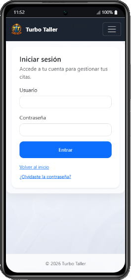
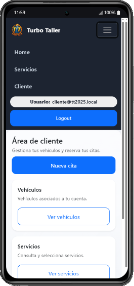
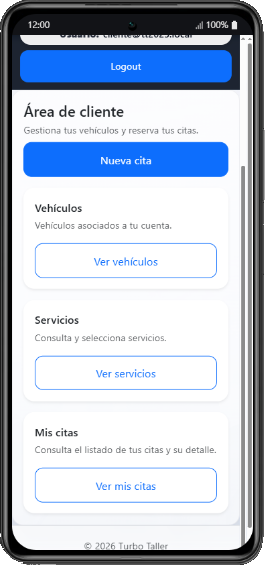
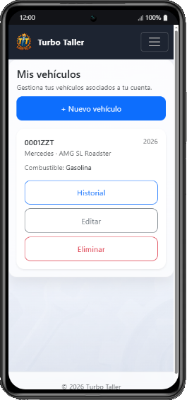
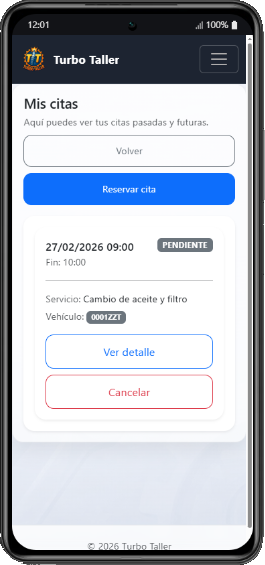
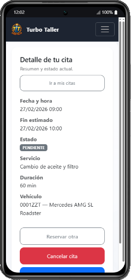
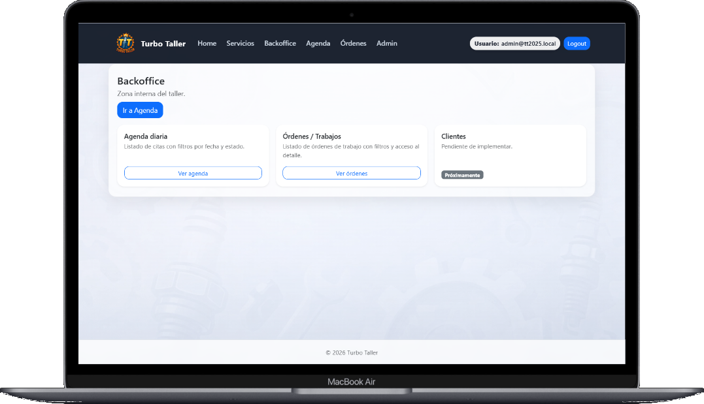
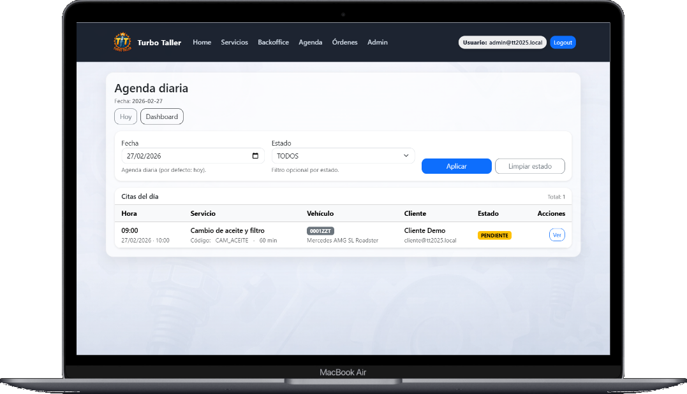
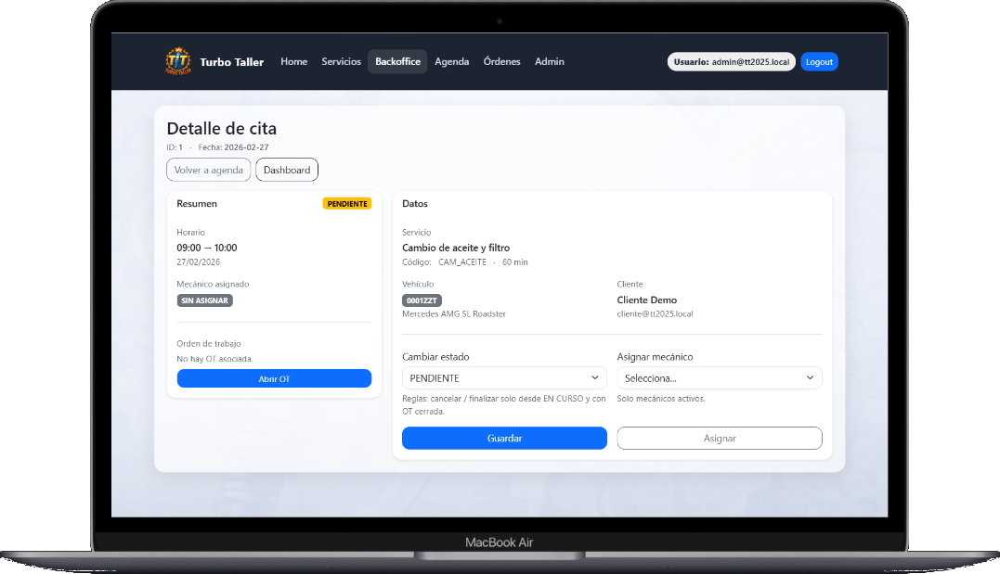

<div style="display: flex; align-items: center; gap: 12px;">
  
</div>

# TT2025 - Turbo Taller

Turbo Taller (TT2025) digitaliza la gestión de un taller de mecánica rápida. Permite a los clientes registrarse, añadir sus vehículos y reservar citas online seleccionando servicio, fecha y franja horaria. En el backoffice, el personal del taller puede gestionar la agenda, asignar trabajos, actualizar estados (pendiente/en curso/finalizada/cancelada), registrar intervenciones y piezas, y consultar el historial por cliente y vehículo. El objetivo es reducir errores, evitar solapamientos y mejorar la experiencia del cliente con un sistema centralizado y accesible desde cualquier dispositivo.

---

## Stack / Tecnologías

Aplicación web desarrollada con Spring Boot (Java 17) y Thymeleaf, utilizando MariaDB como base de datos.

- **Java:** 17  
- **IDE:** Spring Tool Suite **4.32.0 (STS)**
- **Framework:** Spring Boot + Thymeleaf
- **Frontend:** HTML5, CSS3, JavaScript
- **DB:** MariaDB **12.1.2**
- **Build:** Maven

---

## Requisitos

- Java **17** instalado (JAVA_HOME configurado)
- STS **4.32.0** (recomendado)
- MariaDB **12.1.2**
- Maven (o usar el wrapper `mvnw` si está incluido)

---

## Puesta en marcha (local)

### 1) Base de datos
Crea una base de datos en MariaDB:

```sql
DROP DATABASE IF EXISTS tt2025;
CREATE DATABASE tt2025 CHARACTER SET utf8mb4 COLLATE utf8mb4_unicode_ci;
```

### 2) Configuración del proyecto 

- El proyecto utiliza perfiles de Spring (`dev`, `prod`, etc.) para separar configuraciones por entorno.

- La configuración general se encuentra en:
	`src/main/resources/application.properties`

- La configuración específica de desarrollo local se encuentra en:
	`src/main/resources/application-dev.properties`
	
Plantilla disponible en:
📄 [application-dev.properties.example](src/main/resources/application-dev.properties.example)

Copia este fichero como `application-dev.properties` y configura tus credenciales locales.

**application-dev.properties**

```
==============================
# DEV (LOCAL) - MariaDB
# ============================

spring.datasource.url=jdbc:mariadb://localhost:3306/tt2025
spring.datasource.username=USERNAME
spring.datasource.password=PASSWORD
spring.datasource.driver-class-name=org.mariadb.jdbc.Driver

# Otras propiedades opcionales según entorno
```

> Recomendado: usar variables de entorno en lugar de credenciales en el repo.

> `application-dev.properties` debe estar incluido en `.gitignore`.

### 3) Ejecutar la aplicación

**Opción A (STS):**
- Import → Existing Maven Project
- Run → Spring Boot App

**Opción B (terminal):**

Linux / macOS:
```bash
./mvnw spring-boot:run -Dspring-boot.run.profiles=dev
```

Windows:
```bat
mvnw.cmd spring-boot:run -Dspring-boot.run.profiles=dev
```

### 4) Flyway (DEV) — Inicialización automática de base de datos

El proyecto utiliza **Flyway** para gestionar el versionado y la evolución del esquema de base de datos.

### ¿Qué ocurre en el primer arranque?

Cuando la aplicación se inicia con el perfil `dev` y la base de datos `tt2025` está vacía:

1. Flyway detecta las migraciones en:
   ```
   src/main/resources/db/migration
   ```
2. Ejecuta automáticamente los scripts `V1`, `V2`, `V3`, etc., en orden.
3. Crea la tabla de control:
   ```
   flyway_schema_history
   ```
4. Registra qué migraciones se han aplicado correctamente.

Esto garantiza que cualquier desarrollador que clone el repositorio pueda levantar la base de datos desde cero sin ejecutar SQL manual adicional.

---

### Cómo comprobar que Flyway ha aplicado correctamente las migraciones

En MariaDB:

```sql
USE tt2025;

SHOW TABLES;

SELECT installed_rank, version, description, success
FROM flyway_schema_history
ORDER BY installed_rank;
```

Si las migraciones aparecen con `success = 1`, la base de datos está correctamente inicializada.

---

### Usuarios de prueba (solo perfil DEV)

En entorno de desarrollo (`dev`), el sistema crea automáticamente usuarios de prueba para facilitar la validación funcional.

### Usuario CLIENTE

- Email: `cliente@tt2025.local`
- Password: `1234`
- Rol: `CLIENTE`

### Usuario ADMIN

- Email: `admin@tt2025.local`
- Password: `1234`
- Rol: `ADMIN`

> Las contraseñas no se almacenan en texto plano.  
> Se guardan hasheadas mediante el mecanismo de seguridad configurado en Spring Security.

Estos usuarios permiten:

- Acceder a la zona cliente (`/cliente/...`)
- Acceder a Backoffice (`/backoffice/...`)
- Acceder a Swagger, Actuator y `/dev/mappings` (ADMIN)

---

### Verificación en base de datos

Puedes comprobar que los usuarios existen ejecutando:

```sql
SELECT email, activo
FROM users
WHERE email IN ('cliente@tt2025.local', 'admin@tt2025.local');
```

---

## Importante

Los usuarios de prueba solo deben existir en perfil `dev`.

En un entorno de producción:

- No deben existir credenciales por defecto.
- La creación de usuarios debe realizarse de forma controlada.
- Deben usarse contraseñas seguras.


### 5) Abrir en el navegador
- App: `http://localhost:8080`

---

### URLs útiles

- Home: `http://localhost:8080/`
- Login: `http://localhost:8080/login`
- Swagger (ADMIN): `http://localhost:8080/swagger-ui/index.html`
- Actuator (ADMIN): `http://localhost:8080/actuator`
- Dev mappings (ADMIN - perfil dev): `http://localhost:8080/dev/mappings`


## Accesos y herramientas de desarrollo

### Swagger (OpenAPI)

El proyecto expone una **API REST** para catálogo, vehículos y citas, documentada mediante **Swagger / OpenAPI.**

- **URL:**
```
http://localhost:8080/swagger-ui/index.html
```

- **Acceso:**  
🔐 **Solo usuarios con rol ADMIN**

Swagger documenta únicamente endpoints REST (`@RestController`).
Las rutas MVC (`@Controller` + Thymeleaf) no aparecen en Swagger.

En producción, Swagger puede deshabilitarse mediante configuración por perfil.

---

### Actuator (monitorización)

Se utiliza **Spring Boot Actuator** para inspección técnica en entorno de desarrollo.

- Endpoints disponibles (según configuración):
```
/actuator
/actuator/health
/actuator/mappings
```

- **Acceso:**  
🔐 **Solo usuarios con rol ADMIN**

Actuator permite visualizar mappings, beans y estado de la aplicación.  
Por seguridad, no debe exponerse públicamente en producción.

---

### Dev mappings (rutas MVC + REST)

Para facilitar el desarrollo y depuración, el proyecto incluye una **vista HTML propia** que lista **todas las rutas registradas en Spring** (MVC y REST).

- **URL:**
```
http://localhost:8080/dev/mappings
```

- **Incluye:**
  - Rutas `@Controller` (Thymeleaf)
  - Rutas `@RestController`
  - Método HTTP y handler

- **Acceso:**  
🔐 **Solo usuarios con rol ADMIN**

- **Disponibilidad:**  
✔️ Solo en perfil `dev` (`@Profile("dev")`)

Esta vista es una alternativa visual a `/actuator/mappings`, pensada para desarrollo local.

---

## MailHog (DEV) — Configuración y funcionamiento (TT2025)

MailHog es un **SMTP de pruebas** para desarrollo. Captura emails enviados por la aplicación y los muestra en una **bandeja web**, sin enviar nada a correos reales. Es ideal para el MVP porque:
- Permite **probar notificaciones** sin credenciales reales.
- Evita depender de Gmail/Outlook/SendGrid.
- Facilita comprobar asunto, body y destinatarios.

### 1) ¿Qué puertos usa?

- **SMTP (entrada de correos):** `localhost:1025`
- **UI Web (bandeja):** `http://localhost:8025`

### 2) Arranque de MailHog

### Opción recomendada: Docker
```bash
docker run --rm -p 1025:1025 -p 8025:8025 mailhog/mailhog
```

---

## Seguridad y roles

El proyecto utiliza **Spring Security** con autenticación basada en formulario (`formLogin`) y control de acceso por roles.

### Roles principales

**CLIENTE**
- Perfil
- Vehículos
- Citas

**PERSONAL / TALLER**
- Agenda
- Órdenes de trabajo
- Estados de servicio

**ADMIN**
- Acceso a Swagger
- Acceso a Actuator
- Acceso a `/dev/mappings`
- Funciones de administración del sistema

---

## Zonas protegidas (resumen)

**Control de acceso por rutas**
<table>
  <thead>
    <tr>
      <th>Ruta</th>
      <th>Acceso</th>
    </tr>
  </thead>
  <tbody>
    <tr>
      <td><code>/swagger-ui/**</code>, <code>/v3/api-docs/**</code></td>
      <td style="padding-left:90px;">ADMIN</td>
    </tr>
    <tr>
      <td><code>/actuator/**</code></td>
      <td style="padding-left:90px;">ADMIN</td>
    </tr>
    <tr>
      <td><code>/dev/**</code></td>
      <td style="padding-left:90px;">ADMIN</td>
    </tr>
    <tr>
      <td><code>/cliente/**</code></td>
      <td style="padding-left:90px;">CLIENTE</td>
    </tr>
    <tr>
      <td><code>/backoffice/**</code></td>
      <td style="padding-left:90px;">PERSONAL / ADMIN</td>
    </tr>
    <tr>
      <td><code>/admin/**</code></td>
      <td style="padding-left:90px;">ADMIN</td>
    </tr>
  </tbody>
</table>

---

## Convenciones de Git

### Ramas
- `main`: estable (lista para entrega/despliegue)
- `develop`: integración
- `feature/*`: nuevas funcionalidades (desde `develop`)
  - Ej: `feature/citas`, `feature/login`
- `fix/*`: correcciones de bugs
  - Ej: `fix/solape-citas`

### Commits
Formato:
`<tipo>: <mensaje corto en infinitivo>`

- `feat:` nueva funcionalidad  
- `fix:` corrección de bug  
- `docs:` documentación  
- `chore:` mantenimiento/configuración  

Ejemplos:
- `feat: crear formulario de registro`
- `fix: evitar solapes en reservas`
- `docs: actualizar README con ejecución`
- `chore: añadir .gitignore para STS`

---

## Alcance MVP (mínimo viable)

- Registro/login + roles básicos
- Alta de vehículos
- Catálogo de servicios (listar)
- Reserva de cita con validación de disponibilidad (sin solapes)
- Backoffice: agenda diaria + cambio de estado
- Orden de trabajo: intervención + piezas + cierre
- Historial por vehículo/cliente
- Email de confirmación (mínimo)

---

## Estructura del proyecto (orientativa)

```text
es.prw
 ├─ Tt2025Application.java
 ├─ config
 │   ├─ security
 │   ├─ openapi
 │   └─ web
 ├─ common
 │   ├─ exception
 │   ├─ util
 │   └─ constants
 └─ features
     ├─ cliente
     │   ├─ vehiculos
     │   │   ├─ web
     │   │   ├─ dto
     │   │   ├─ domain
     │   │   ├─ repository
     │   │   ├─ service
     │   │   └─ validation
     │   ├─ servicios
     │   │   ├─ web
     │   │   ├─ dto
     │   │   ├─ domain
     │   │   ├─ repository
     │   │   ├─ service
     │   │   └─ validation
     │   └─ citas
     │       └─ ...
     ├─ empleado
     │   └─ ...
     └─ admin
         └─ ...
```

---

## Estado del proyecto

En desarrollo.  
Las tareas se gestionan en GitHub Projects (Backlog → Ready → In Progress → In Review → Done).

---

## Tests 
- Véase 📄 **[TESTING.md](TESTING.md).**

Ejecutar tests dev:

```bash
mvn test
```
---

## Screenshots

### Vista Móvil

<div style="display: flex; gap: 12px; justify-content: center; margin-bottom: 12px;">
  
  
  
</div>

<div style="display: flex; gap: 12px; justify-content: center; margin-bottom: 12px;">
  
  
  
</div>

---

### Vista escritorio

<div style="display: flex; gap: 16px; justify-content: center; margin-bottom: 12px;">
  
  
</div>

<div style="display: flex; gap: 16px; justify-content: center; margin-bottom: 24px;">
  
  
</div>

---
## Documentación

- Véase 📄 **[Plan de Proyecto](./docs/A0_PLAN%20DE%20PROYECTO.pdf).**
- Véase 📄 **[Documento de Alcance](./docs/A1_DOCUMENTO%20DE%20ALCANCE.pdf).**
- Véase 📄 **[Diagrama de Casos de Uso](./docs/A2_DIAGRAMA%20DE%20CASOS%20DE%20USO.pdf).**
- Véase 📄 **[Diagrama Entidad Relación](./docs/A3_DIAGRAMA%20ENTIDAD%20RELACIÓN.pdf).**
- Véase 📄 **[Documento Técnico](./docs/A4_DOCUMENTO%20TÉCNICO.pdf).**
- Véase 📄 **[Documento de Despliegue](./docs/A5_DOCUMENTO%20DE%20DESPLIEGUE.pdf).**

## Legal
- Véase 📄 **[AVISO.md](AVISO.md).** Todos los derechos reservados.
- See 📄 **[NOTICE.md](NOTICE.md).** All rights reserved.
